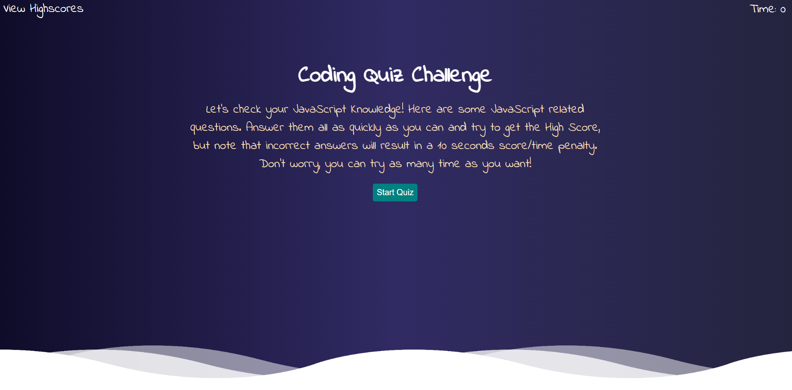
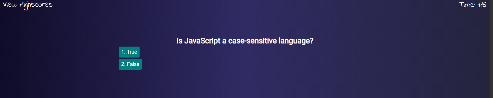

# Code-Quiz Challenge

1. [Description](#desc)
2. [Web Address](#web)
3. [Usage Tips](#usage)
4. [Contributing](#contr)
5. [License](#license)

<a name="desc"></a>

## 1. Description

A timer-based quiz application is build with HTML, CSS, and JavaScript. The quiz is multiple-choice and relies on a timer to determine how well the user performs when taking the quiz.
<br>
<br>
The timer will start after the start button is clicked. Counting down from 120 seconds and every tie the user submits the wrong answer it will penalize 15 seconds from the countdown. The application is using localStorage to store the user's score to the browser so that when user returns, they can track previous quiz attempts and try to beat their high score.
<br>
<br>

#### Screenshots:

## Start Screen



## Question Screen



## HighScore Screen


<a name="web"></a>

## 2. How to Get There

Click on the below link to access the Portfolio

https://hrsautomation20.github.io/code-quiz/

<b>OR</b><br> Copy and past below URL to your favorite browser

```html
https://hrsautomation20.github.io/code-quiz/
```

---

<a name="usage"></a>

## 3. Usage Tips

1. On a start page, user can start the quiz by pressing "Start Quiz" button, which starts quiz by initializing time limit for quiz.
2. When quiz starts, user is presented with one question at a time with multiple choice to choose correct answer. When user selects answer, User can see the feedback basis on if the given answer is correct or wrong.
3. If chosen answer is wrong, there is a time penalty of 15 seconds. Hence, 15 seconds are reduced from remaining time.
4. When quiz ends or when remaining time reaches 0, user is presented his final score and he/she is asked to provide the name/initials to store the score.
5. User can view previous highscores of users from "Highscore" link on the start page.

---

<a name="contr"></a>

## 4. Contributing

For the Password-Generator tool enhancement please contact the repo owner and provide the feedback. For local copy pull/download.zip files are welcome.

---

<a name="license"></a>

## 5. License

No License are required

---

© 2021 HR All Rights Reserved.
